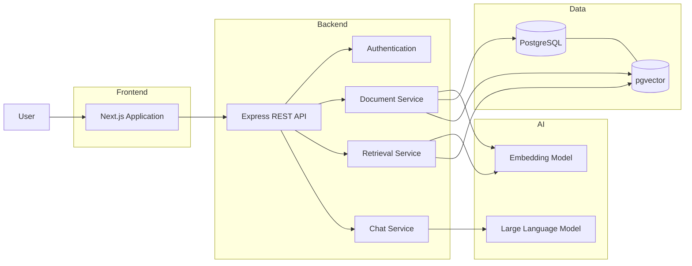
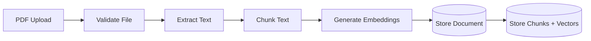
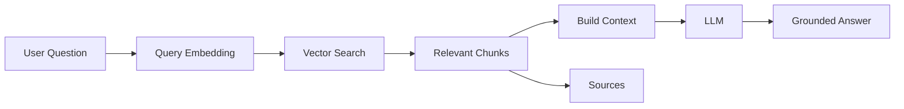

# Ekano Architecture

## Overview

Ekano is an Enterprise Knowledge Assistant built using
Retrieval-Augmented Generation (RAG).

It allows users to upload organizational documents and ask questions
about the information contained within those documents.

Instead of relying only on the knowledge already present inside a
Large Language Model, Ekano retrieves relevant information from the
organization's knowledge base and provides that information to the LLM
as context before generating a response.

The system therefore consists of two major workflows:

1. Document ingestion
2. Question answering / retrieval

---

## High-Level Architecture



---

# Core Components

## 1. Frontend

The frontend is built using:

- Next.js
- React
- TypeScript
- Tailwind CSS
- Axios

The frontend is responsible for the product experience rather than
performing AI operations directly.

Its main responsibilities are:

- authentication UI
- document upload
- knowledge-base management
- chat interface
- displaying generated responses
- displaying document sources
- dashboard and settings UI

AI provider credentials and database access are never exposed to the
browser.

All sensitive operations are performed by the backend.

---

## 2. Backend

The backend is built using Node.js, TypeScript and Express.

It acts as the orchestration layer between:

- the frontend
- PostgreSQL
- pgvector
- the embedding model
- the LLM

The backend follows a layered design:

```text
Route
  ↓
Controller
  ↓
Service
  ↓
Repository / External Provider
```

For example:

```text
POST /documents/upload

Route
  ↓
Document Controller
  ↓
Document Service
  ↓
PDF Parser
  ↓
Embedding Service
  ↓
Document Repository
  ↓
PostgreSQL
```

This separation keeps HTTP-related logic away from business and data
access logic.

It also makes the architecture easier to extend and test.

---

# Document Ingestion Architecture

When a user uploads a PDF, the document passes through an ingestion
pipeline.



The current flow is:

```text
PDF
 ↓
Multer
 ↓
PDF parsing
 ↓
Extracted text
 ↓
Chunking
 ↓
Embedding generation
 ↓
PostgreSQL + pgvector
```

### File validation

Uploads are currently restricted to:

- PDF files
- maximum size of 10 MB

The backend performs validation rather than relying solely on the
frontend.

This is important because client-side validation can always be
bypassed.

---

## Text Extraction

The uploaded PDF is held in memory and processed using `pdf-parse`.

The text is extracted before creating embeddings.

Ekano currently focuses on text-based PDFs.

More advanced document processing such as OCR, images, tables and
layout-aware parsing would be future improvements.

---

## Chunking

The extracted text is divided into smaller overlapping chunks.

Current configuration:

```text
Chunk size: approximately 500 characters
Overlap: approximately 100 characters
```

Chunking is necessary because embedding an entire document as a single
vector would significantly reduce retrieval precision.

For example, a 30-page employee handbook may contain information about:

- leave
- remote work
- expenses
- security
- probation
- notice periods

Representing all of this information with one embedding would make it
difficult to retrieve the exact passage relevant to a specific
question.

Smaller chunks provide more granular semantic retrieval.

### Why overlap?

A hard chunk boundary can divide meaningful information.

For example:

```text
Chunk A:
Employees may carry forward a maximum of

Chunk B:
10 unused annual leave days into the following year.
```

Without overlap, the complete fact may not exist inside either
retrieval unit.

Overlap preserves some context around chunk boundaries.

---

# Embeddings

Each document chunk is converted into a numerical vector using an
embedding model.

Ekano currently uses an embedding model that produces vectors with:

```text
2048 dimensions
```

Conceptually:

```text
"Employees receive 24 annual leave days"

        ↓ embedding model

[0.18, -0.37, 0.91, ..., 0.42]
```

The vector does not directly store words.

Instead, it represents semantic features of the text in a numerical
space.

Texts with similar meanings should generally have vectors located
closer together.

---

# Vector Storage

Ekano stores vectors inside PostgreSQL using the `pgvector` extension.

The main tables are:

```text
documents
document_chunks
```

Relationship:

```text
documents
    1
    │
    │
    N
document_chunks
```

Each chunk stores:

- its document ID
- chunk content
- chunk position
- embedding vector

The vector column currently uses:

```sql
vector(2048)
```

---

# Why PostgreSQL + pgvector?

A separate vector database was not required for Ekano V1.

PostgreSQL already stores the application’s structured data, so
pgvector allows Ekano to store relational information and vectors
inside the same database.

This keeps the architecture simple.

For example, retrieval can return both:

```text
chunk content
+
document title
```

without requiring synchronization between two different databases.

Alternatives considered for a larger system could include:

- Qdrant
- Pinecone
- Weaviate
- dedicated vector-search infrastructure

For the expected V1 scale, PostgreSQL + pgvector provides a good
balance between simplicity and capability.

---

# Query Architecture

When a user asks a question, Ekano runs a second RAG pipeline.



The flow is:

```text
Question
 ↓
Generate query embedding
 ↓
Compare against stored chunk embeddings
 ↓
Retrieve relevant chunks
 ↓
Build LLM context
 ↓
Generate response
 ↓
Return response + sources
```

---

# Semantic Search

Ekano uses cosine distance for vector similarity search.

The PostgreSQL pgvector operator used is:

```sql
<=>
```

Conceptually:

```text
Question:
"How many unused leave days can I carry forward?"

        ↓

Query embedding

        ↓

Compare against document chunk vectors
```

Possible results:

```text
Annual leave chunk        distance 0.18
Employee handbook chunk   distance 0.29
Security policy chunk     distance 0.81
```

A smaller cosine distance means greater semantic similarity.

---

# Retrieval Configuration

Ekano currently uses:

```text
TOP_K = 3
Maximum cosine distance = 0.65
```

These parameters serve different purposes.

`TOP_K` limits the maximum number of chunks returned.

The distance threshold prevents Ekano from accepting a result simply
because it happens to be one of the nearest vectors.

For example, if no document is actually relevant, there will still
technically be a "closest" vector.

The threshold allows Ekano to discard weak matches.

---

# Why TOP_K = 3?

Retrieving more context is not always better.

Too few chunks can result in missing information.

Too many chunks can:

- introduce irrelevant context
- increase prompt size
- increase model cost
- confuse the generation step

For V1, three chunks provided a reasonable starting point.

It is not treated as a universally optimal value.

A production system should tune this parameter using a retrieval
evaluation dataset.

---

# Known Retrieval Limitation

One limitation discovered during testing was multi-topic queries.

For example, a user might ask:

```text
How many annual leave days do I get,
what is the travel reimbursement limit,
what is the remote-work policy,
and what is the learning budget?
```

These topics may exist in four different documents.

With:

```text
TOP_K = 3
```

only three chunks can reach the LLM.

The problem is therefore not necessarily the LLM.

The missing information may never have been retrieved.

Possible future solutions include:

- query decomposition
- dynamic top-K
- reranking
- hybrid search
- multi-stage retrieval

This was an important design insight from building Ekano:
generation quality is limited by retrieval quality.

---

# Context Construction

Retrieved chunks are converted into a context block before the LLM is
called.

Conceptually:

```text
Company Knowledge:

Source: Employee Handbook
Employees receive 24 annual leave days...

Source: Remote Work Policy
Employees may work remotely up to two days...
```

The context is then included in the model prompt.

This allows the LLM to reason over information retrieved from the
organization's documents.

---

# Grounding

Ekano instructs the LLM to distinguish between:

1. general conversation
2. organization-specific questions

For organization-specific questions, the model is instructed to:

- use only the retrieved company knowledge
- ignore irrelevant context
- avoid inventing organization-specific information
- state when sufficient information is unavailable

This reduces hallucination risk.

However, because an LLM remains a generative system, prompt grounding
cannot guarantee perfect factual accuracy.

A stronger production implementation could include:

- automated RAG evaluation
- citation verification
- answer faithfulness scoring
- output validation
- human-reviewed benchmark datasets

---

# Source Attribution

Ekano returns source information together with the generated answer.

Retrieval operates at the chunk level, meaning multiple retrieved
chunks may belong to the same document.

For example:

```text
Chunk 1 → Employee Handbook
Chunk 2 → Employee Handbook
Chunk 3 → Remote Work Policy
```

Initially this caused duplicate source names to appear in the UI.

Sources are now deduplicated before being returned to the client.

This illustrates an important distinction:

```text
Retrieval unit = chunk

Displayed source = document
```

For a larger system, source attribution could be improved further by
returning:

- document ID
- page number
- section
- paragraph
- exact citation range

---

# Authentication

Ekano uses cookie-based authentication.

The backend creates a JWT after successful authentication and stores it
inside an HTTP-only cookie.

The browser then sends that cookie automatically with authenticated
requests.

The frontend API client uses:

```text
withCredentials: true
```

because frontend and backend may run on different origins.

Important cookie properties include:

```text
HttpOnly
Secure in production
SameSite=None for cross-site production usage
```

`HttpOnly` prevents frontend JavaScript from directly reading the
token.

Sensitive API authorization must ultimately be enforced by the backend.

Frontend route protection should only be considered an additional UX
layer rather than the security boundary.

---

# Cross-Origin Architecture

The frontend and backend can run on different origins.

Therefore Ekano must configure both:

```text
CORS
+
credentialed cookies
```

The backend explicitly allows the configured frontend origin and
enables credentials.

The browser API client also enables credentials.

Both sides are required.

Without backend credential support:

```text
browser → API
cookie rejected
```

Without frontend credential support:

```text
browser → API
cookie not included
```

---

# Database Reliability

Document ingestion involves multiple related writes:

```text
document
+
document chunks
+
embeddings
```

The database write stage uses a transaction.

This prevents partially-ingested documents.

For example, if inserting chunk 8 fails after chunks 1–7 were inserted,
the transaction can roll the entire operation back.

The goal is:

```text
Either the complete document is stored

OR

nothing is stored.
```

---

# Database Migrations

Database schema changes are managed through ordered migrations.

Current migration sequence:

```text
000_enable_vector_extension.sql
001_create_documents.sql
002_create_document_chunks.sql
```

The first migration enables:

```sql
CREATE EXTENSION IF NOT EXISTS vector;
```

This ensures pgvector exists before the chunk table attempts to create
a `vector(2048)` column.

Application startup only verifies database connectivity.

Schema creation is not mixed with runtime startup logic.

This separation makes deployments more predictable.

---

# Error Handling

Ekano uses centralized Express error handling.

Examples include:

```text
Invalid file type     → 400
File larger than 10MB → 413
PDF parsing failure   → 400
Unexpected failure    → 500
```

The backend remains responsible for validation even if the frontend
also performs validation.

The frontend displays useful error messages returned by the API.

---

# Deployment Architecture

At a high level, production is separated into:

```text
Browser
   │
   ▼
Frontend Application
   │
   │ HTTPS
   ▼
Backend API
   │
   ├────────► AI Provider
   │
   ▼
PostgreSQL + pgvector
```

This separation allows the frontend, backend and database to scale and
deploy independently.

Environment-specific values such as:

- API URLs
- database connections
- AI provider API keys
- JWT secrets
- demo credentials

are provided through environment variables rather than committed into
source control.

---

# Security Boundaries

Secrets remain server-side.

The frontend does not receive:

```text
AI provider API keys
database credentials
JWT signing secret
```

Environment files containing real credentials are excluded from Git.

The repository contains only example environment files describing the
required configuration.

Uploaded content and AI requests should always be considered sensitive
in a real enterprise deployment.

A production enterprise version would additionally require:

- tenant isolation
- role-based access control
- document-level authorization
- encryption policies
- audit logs
- secret rotation
- data-retention policies
- rate limiting
- monitoring

---

# Design Philosophy

Ekano V1 deliberately prioritizes architectural simplicity.

Instead of introducing:

```text
multiple databases
message queues
microservices
dedicated vector infrastructure
Kubernetes
complex orchestration
```

the system uses:

```text
Next.js
Express
PostgreSQL
pgvector
External AI models
```

This is sufficient for validating the core product idea while keeping
the system understandable and maintainable.

Architecture should solve the current problem rather than imitate the
architecture of a company operating at a completely different scale.

---

# Current Limitations

Ekano V1 intentionally has several limitations:

- PDF-focused ingestion
- simple character-based chunking
- fixed TOP_K
- fixed similarity threshold
- no reranker
- no hybrid keyword/vector search
- limited document metadata
- limited citation granularity
- simple demo authentication
- no tenant isolation
- no conversation persistence
- no retrieval evaluation framework

These are useful areas for future iterations rather than hidden flaws.

---

# Potential V2 Architecture

A more advanced version could introduce:


Potential additions include:

- hybrid semantic + keyword retrieval
- query decomposition
- reranking
- metadata filtering
- tenant-aware retrieval
- document-level access control
- conversation memory
- streaming responses
- asynchronous document ingestion
- RAG evaluation
- observability
- detailed citations

---

# Key Architectural Principle

The most important architectural idea behind Ekano is:

> The LLM is not the knowledge base.

The knowledge lives in the organization's documents.

The retrieval system determines what information is made available to
the LLM.

The LLM's job is to interpret and communicate that retrieved
information.

Therefore:

```text
Good Generation
      depends on
Good Context
      depends on
Good Retrieval
      depends on
Good Ingestion
```

This is the core design principle behind Ekano.