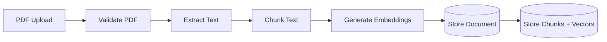
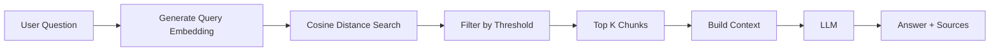
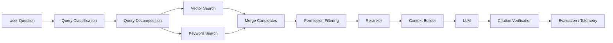

# Ekano RAG Pipeline

## Overview

Ekano uses Retrieval-Augmented Generation, or RAG, to answer questions using an organization's own documents.

A normal LLM does not automatically know private company information.

For example, if a user asks:

> How many annual leave days can I carry forward?

the LLM should not guess the company's policy.

Instead, Ekano first retrieves the most relevant information from the organization's uploaded documents and then provides that information to the LLM as context.

The high-level flow is:

```text
Documents
   ↓
Parse
   ↓
Chunk
   ↓
Embed
   ↓
Store vectors
   ↓

User Question
   ↓
Embed query
   ↓
Vector similarity search
   ↓
Retrieve relevant chunks
   ↓
Build context
   ↓
LLM
   ↓
Grounded answer + sources
```

This separates the system into two major pipelines:

1. Ingestion
2. Retrieval and generation

---

# 1. Document Ingestion

The ingestion pipeline prepares uploaded documents so they can later be searched semantically.



---

## 1.1 PDF Upload

Users upload PDFs through the frontend.

The frontend sends the file to the backend using multipart form data.

The backend uses Multer for file handling.

Current restrictions include:

```text
File type: PDF
Maximum size: 10 MB
Storage during processing: memory
```

Validation is performed on the backend.

Frontend validation is useful for user experience, but it must not be treated as a security boundary because a user can bypass the frontend and call the API directly.

---

## 1.2 Text Extraction

After receiving the PDF, Ekano extracts its text using `pdf-parse`.

Conceptually:

```text
PDF binary data

        ↓

PDF parser

        ↓

Plain text
```

For example, a policy PDF might become:

```text
Northstar Technologies Employee Handbook

Annual Leave

Employees receive 24 annual leave days per calendar year.
A maximum of 10 unused days may be carried into the next year...
```

The extracted text is then passed to the chunking stage.

Ekano V1 primarily targets text-based PDFs.

Documents containing scanned pages, complex tables, images or layout-dependent information may require more advanced processing such as OCR or layout-aware document parsing.

---

# 2. Why Chunking Is Necessary

A document should generally not be represented by one single embedding.

Consider a 50-page employee handbook containing:

```text
Leave policy
Remote work
Security
Travel
Probation
Notice period
Benefits
Expenses
```

If the entire document were converted into a single vector, all of those concepts would be compressed into one representation.

Then a query such as:

```text
How many annual leave days can I carry forward?
```

would have to match the entire handbook instead of the specific leave section.

Chunking creates smaller retrieval units.

Instead of:

```text
Document → one vector
```

Ekano uses:

```text
Document
   ↓
Chunk 1 → vector
Chunk 2 → vector
Chunk 3 → vector
Chunk 4 → vector
...
```

This increases retrieval granularity.

---

# 3. Ekano's Chunking Strategy

Ekano V1 currently uses approximately:

```text
Chunk size: 500 characters
Chunk overlap: 100 characters
```

For example:

```text
Original document:

Employees receive 24 annual leave days each year.
Unused leave may be carried forward into the next calendar year.
A maximum of 10 days may be carried forward.
Employees should receive manager approval before taking leave.
```

This might produce chunks conceptually like:

```text
Chunk 1:
Employees receive 24 annual leave days each year.
Unused leave may be carried forward into the next calendar year...

Chunk 2:
...carried forward into the next calendar year.
A maximum of 10 days may be carried forward.
Employees should receive manager approval...
```

---

# 4. Why Use Overlap?

Chunk boundaries are artificial.

Important information can fall across a boundary.

Without overlap:

```text
Chunk 1:
Employees may carry forward a maximum of

Chunk 2:
10 unused annual leave days into the following year.
```

A retrieval system might retrieve only one of those chunks and lose the complete fact.

With overlap:

```text
Chunk 1:
Employees may carry forward a maximum of 10 unused annual leave...

Chunk 2:
...a maximum of 10 unused annual leave days into the following year.
```

Some information is repeated between neighboring chunks.

This slightly increases storage and embedding cost, but preserves context around boundaries.

---

# 5. Why 500 Characters?

The current value is an MVP design choice rather than a mathematically optimal number.

There is a trade-off.

Very small chunks improve precision but may remove surrounding context.

For example:

```text
Chunk:
10 days.
```

This may be semantically weak because it no longer explains what the 10 days refer to.

Very large chunks preserve more context but may contain many unrelated concepts.

For example:

```text
Annual leave + sick leave + remote work + travel + security
```

A query may then retrieve more irrelevant information.

The goal is therefore to balance:

```text
Retrieval precision
        vs
Context completeness
```

Ekano currently uses 500-character chunks as a reasonable V1 starting point.

A mature system should tune chunk size using evaluation data rather than intuition alone.

---

# 6. Embeddings

After chunking, Ekano converts each chunk into an embedding.

An embedding is a numerical representation of text.

Conceptually:

```text
"Employees receive 24 annual leave days"

             ↓

       Embedding model

             ↓

[0.182, -0.422, 0.713, ..., -0.102]
```

Ekano's current embedding vectors contain:

```text
2048 dimensions
```

The individual numbers are not directly meaningful to humans.

Their value comes from their position relative to other vectors.

Texts with similar semantic meaning tend to be located closer together in the embedding space.

For example:

```text
"How many days can I work remotely?"

and

"What is the work-from-home allowance?"
```

use different words but express similar concepts.

A good embedding model should therefore produce relatively similar vectors for them.

---

# 7. Why Embeddings Instead of Keyword Search?

Traditional keyword search relies heavily on matching words.

Suppose the policy says:

```text
Employees may work remotely up to two days each week.
```

The user asks:

```text
What is the work-from-home limit?
```

The document contains:

```text
remote
```

while the query contains:

```text
work-from-home
```

A simple exact keyword system may not recognize them as equivalent.

Embeddings represent semantic meaning rather than exact wording.

That makes semantic search useful for natural-language questions.

This does not mean vector search should always replace keyword search.

A mature system may combine both approaches using hybrid search.

---

# 8. Why Must Documents and Queries Use the Same Embedding Model?

During ingestion, document chunks are embedded.

Later, the user's question is also embedded.

Both must exist in the same vector space.

For example:

```text
Document chunk
     ↓
Embedding Model A
     ↓
Vector A
```

and:

```text
User query
     ↓
Embedding Model A
     ↓
Vector B
```

Now the vectors can be meaningfully compared.

If the document were embedded using one unrelated model and the query using another:

```text
Document → Model A
Query    → Model B
```

their numerical coordinates would represent different embedding spaces.

Comparing those vectors would therefore not provide meaningful semantic similarity.

This is why Ekano uses the same embedding model for ingestion and retrieval.

---

# 9. Vector Storage

Ekano stores document embeddings in PostgreSQL using the pgvector extension.

The chunk table contains approximately:

```text
id
document_id
content
chunk_index
embedding
created_at
```

The embedding column is:

```sql
vector(2048)
```

Each chunk therefore contains both:

```text
human-readable text
+
machine-searchable vector
```

---

# 10. Why PostgreSQL + pgvector?

Ekano already needs a relational database for document metadata.

Using pgvector allows the system to store:

```text
Documents
Chunks
Relationships
Vectors
```

inside the same database.

This avoids introducing a separate vector database for the V1.

For example:

```text
document_chunks
      ↓
document_id
      ↓
documents
      ↓
document title
```

Vector retrieval can therefore easily return the relevant chunk together with its document information.

For Ekano's current scale, this simplifies:

```text
Infrastructure
Development
Deployment
Data consistency
```

A dedicated vector database such as Qdrant or Pinecone may become useful if scale, indexing requirements, filtering or retrieval performance justify the additional infrastructure.

---

# 11. Query Pipeline

When a user asks a question, Ekano performs retrieval before calling the LLM.



Example query:

```text
How many annual leave days do I get,
and how many can I carry forward?
```

Ekano first generates an embedding for that question.

---

# 12. Vector Similarity Search

The query embedding is compared against all relevant stored chunk embeddings.

Ekano uses cosine distance.

With pgvector, the operator is:

```sql
<=>
```

Conceptually:

```sql
SELECT
    content,
    embedding <=> query_embedding AS distance
FROM document_chunks
ORDER BY distance
LIMIT 3;
```

The actual implementation may also join document metadata such as the document title.

---

# 13. Cosine Similarity vs Cosine Distance

This distinction is important.

Cosine similarity measures how similar the directions of two vectors are.

A simplified formula is:

```text
cosine_similarity(A, B)

       A · B
= ----------------
   ||A|| × ||B||
```

Higher cosine similarity generally means greater similarity.

pgvector's:

```sql
<=>
```

returns cosine distance.

Conceptually:

```text
cosine distance = 1 - cosine similarity
```

Therefore:

```text
Smaller distance = more similar
```

Example:

```text
Chunk A → distance 0.15
Chunk B → distance 0.31
Chunk C → distance 0.77
```

Chunk A is the strongest semantic match.

This is why Ekano orders results by ascending distance.

---

# 14. TOP_K

Ekano currently uses:

```text
TOP_K = 3
```

This means a maximum of three chunks are selected for the generation context.

Why not retrieve 50 chunks?

Because more context is not automatically better.

Too much retrieved information can introduce:

```text
irrelevant information
conflicting information
larger prompts
higher model cost
higher latency
context distraction
```

Too little context can result in:

```text
missing information
incomplete answers
poor recall
```

`TOP_K = 3` is therefore a deliberate V1 starting point.

It is not assumed to be universally optimal.

---

# 15. Similarity Threshold

Ekano also applies:

```text
MAX_COSINE_DISTANCE = 0.65
```

This is separate from TOP_K.

Suppose the database contains 10,000 chunks and none are actually relevant.

There will still mathematically be a:

```text
1st closest chunk
2nd closest chunk
3rd closest chunk
```

But "closest" does not necessarily mean "relevant."

For example:

```text
Chunk A → 0.81
Chunk B → 0.86
Chunk C → 0.89
```

These may all be poor matches.

Without a threshold, Ekano might send those unrelated chunks to the LLM.

The distance threshold creates a minimum relevance requirement.

Conceptually:

```text
distance <= 0.65
    → accept

distance > 0.65
    → reject
```

This helps reduce irrelevant grounding context.

---

# 16. TOP_K vs Threshold

These solve different problems.

```text
TOP_K
↓
How many results can I retrieve?

Threshold
↓
Are those results relevant enough?
```

Example:

```text
TOP_K = 3
Threshold = 0.65
```

Search results:

```text
Chunk A → 0.20
Chunk B → 0.38
Chunk C → 0.71
```

The database returns three nearest candidates.

But after threshold filtering:

```text
Chunk A ✓
Chunk B ✓
Chunk C ✗
```

Only two chunks should enter the context.

---

# 17. Retrieval Context

The retrieved chunks are converted into text before being passed to the LLM.

Ekano currently builds context conceptually like:

```text
Source: Northstar Employee Handbook
Employees receive 24 annual leave days each year.
A maximum of 10 unused days may be carried forward...

Source: Remote Work & Equipment Policy
Employees may work remotely up to two days per week...
```

This context becomes part of the system prompt.

The LLM therefore receives:

```text
Instructions
+
Retrieved company knowledge
+
Conversation
```

---

# 18. Generation

Ekano then calls the LLM.

The system prompt tells the model that it is an Enterprise Knowledge Assistant.

It distinguishes between:

```text
General conversation

and

Company-specific questions
```

For company-specific questions, the model is instructed to:

```text
Use the provided company knowledge
Do not invent organization-specific facts
Ignore irrelevant retrieved context
State when sufficient information is unavailable
Keep answers concise
```

This is called grounding.

---

# 19. What Grounding Actually Means

Grounding does not mean the LLM suddenly becomes perfectly truthful.

It means the model is supplied with authoritative external context and instructed to rely on it.

Without RAG:

```text
Question
   ↓
LLM
   ↓
Answer from model knowledge / guessing
```

With RAG:

```text
Question
   ↓
Relevant company knowledge
   ↓
LLM
   ↓
Answer based on retrieved context
```

RAG therefore reduces hallucination risk for private company information.

It does not mathematically guarantee that hallucinations are impossible.

---

# 20. Source Attribution

Ekano returns source metadata alongside the generated answer.

For example:

```json
{
  "response": "Employees receive 24 annual leave days...",
  "sources": [
    {
      "title": "Northstar Employee Handbook",
      "distance": 0.21
    }
  ]
}
```

This helps users understand where the answer came from.

---

# 21. Why Source Deduplication Was Needed

Retrieval happens at the chunk level.

Suppose the top results are:

```text
Chunk 4 → Employee Handbook
Chunk 5 → Employee Handbook
Chunk 2 → Remote Work Policy
```

Without processing, the frontend may display:

```text
Employee Handbook
Employee Handbook
Remote Work Policy
```

That is technically correct from the retrieval perspective but poor from a user-experience perspective.

Ekano therefore deduplicates document sources before returning them.

Conceptually:

```text
Retrieval result = chunks

Displayed citations = unique documents
```

A future version should ideally deduplicate using:

```text
document_id
```

rather than title because two different documents could theoretically share the same title.

---

# 22. A Real Retrieval Limitation Found During Testing

One important limitation became visible when testing a large multi-topic question.

For example:

```text
How many annual leave days do I get,
what is the remote-work policy,
what is the travel allowance,
what is the learning budget,
and can confidential source code be uploaded to AI tools?
```

This question refers to multiple documents.

But Ekano currently uses:

```text
TOP_K = 3
```

Therefore the retriever can only return three chunks.

Even if all five answers exist in the knowledge base, some information may never reach the LLM.

This is important:

```text
The LLM cannot answer from context it never received.
```

The failure may therefore occur at:

```text
retrieval
```

rather than:

```text
generation
```

This demonstrates one of the central principles of RAG:

> Generation quality is bounded by retrieval quality.

---

# 23. Why Not Simply Increase TOP_K?

A naive solution would be:

```text
TOP_K = 20
```

But that creates other problems:

```text
more irrelevant context
larger prompts
higher cost
higher latency
possible model confusion
```

The better solution for complex questions may be query decomposition.

---

# 24. Query Decomposition

Suppose the user asks:

```text
What is our leave allowance,
remote-work limit,
and learning budget?
```

Instead of embedding this as one large query, a future Ekano version could decompose it into:

```text
Query 1:
What is the annual leave allowance?

Query 2:
What is the remote-work limit?

Query 3:
What is the learning budget?
```

Each sub-query receives its own retrieval operation.

The resulting contexts can then be combined before generation.

This improves recall for multi-topic questions without globally increasing TOP_K.

---

# 25. Reranking

Vector search is useful for quickly finding candidate chunks.

However, the nearest vectors are not always perfectly ordered by relevance.

A more advanced architecture could use:

```text
Vector Search
      ↓
Candidate chunks
      ↓
Reranker
      ↓
Best chunks
```

For example:

```text
Retrieve top 20 candidates

        ↓

Reranker scores actual query-document relevance

        ↓

Send best 5 to LLM
```

This separates:

```text
candidate retrieval
```

from:

```text
final relevance ranking
```

A reranker can therefore improve precision while still allowing broader initial retrieval.

---

# 26. Hybrid Search

Semantic vector search has limitations.

Some queries depend heavily on exact identifiers.

For example:

```text
INC-4521
ADR-018
API-923
version 4.8.3
```

Embedding search may perform poorly on exact tokens.

Traditional keyword search performs very well in such cases.

A future version of Ekano could combine:

```text
Vector search
+
Keyword / full-text search
```

This is called hybrid search.

Conceptually:

```text
Question
   │
   ├── Semantic search
   │
   └── Keyword search
            ↓
      Merge candidates
            ↓
         Rerank
            ↓
       Final context
```

This would be particularly valuable for enterprise knowledge containing:

```text
ticket numbers
feature IDs
API names
error codes
decision-record IDs
release versions
```

---

# 27. Metadata Filtering

A real enterprise knowledge base may contain documents from:

```text
Engineering
HR
Finance
Security
Legal
Different projects
Different tenants
```

Rather than searching every vector, retrieval could filter by metadata.

For example:

```sql
WHERE department = 'engineering'
```

or:

```sql
WHERE tenant_id = current_user_tenant
```

before or during vector retrieval.

This improves both:

```text
relevance
security
```

For an enterprise system, authorization filtering must occur before unauthorized content can be exposed to the LLM.

---

# 28. Retrieval Authorization

A critical future security principle is:

> The LLM should never receive chunks that the current user is not authorized to access.

Bad architecture:

```text
Retrieve all relevant chunks
        ↓
Send them to LLM
        ↓
Later hide unauthorized citations
```

The sensitive information has already been exposed to the model.

Correct architecture:

```text
User
 ↓
Determine permissions
 ↓
Filter accessible documents
 ↓
Vector search only permitted content
 ↓
LLM
```

Authorization must therefore become part of the retrieval layer.

---

# 29. Atomic Ingestion

Document ingestion creates multiple related records.

For example:

```text
1 document
+
12 chunks
+
12 embeddings
```

If the document is created but only seven chunks are successfully stored, the knowledge base becomes inconsistent.

Ekano therefore performs the database write stage transactionally.

Conceptually:

```text
BEGIN

Insert document
Insert chunk 1
Insert chunk 2
...
Insert chunk N

COMMIT
```

If something fails:

```text
ROLLBACK
```

The goal is:

```text
complete ingestion
OR
no ingestion
```

rather than a partially stored document.

---

# 30. Why Generate Embeddings Before the Database Transaction?

External AI calls may be slow or fail unpredictably.

Holding an open database transaction while waiting on external embedding API calls would unnecessarily keep database resources occupied.

A cleaner design is:

```text
Parse
 ↓
Chunk
 ↓
Generate embeddings
 ↓
BEGIN TRANSACTION
 ↓
Insert document + chunks
 ↓
COMMIT
```

This keeps the database transaction focused on database consistency.

---

# 31. Current Failure Modes

Ekano's RAG pipeline can fail at different stages.

```text
Upload failure
↓
Invalid PDF / oversized file

Parsing failure
↓
Unable to extract useful text

Chunking failure
↓
Poor boundaries or loss of context

Embedding failure
↓
External model/provider error

Retrieval failure
↓
Relevant chunk not returned

Threshold failure
↓
Useful chunk filtered out

Context failure
↓
Too much or too little information

Generation failure
↓
LLM misunderstands context or hallucinates

Citation failure
↓
Answer is correct but attribution is poor
```

Knowing which stage failed is essential when debugging RAG systems.

---

# 32. Precision vs Recall in Retrieval

Two important retrieval concepts are precision and recall.

## Precision

Of the chunks retrieved:

```text
How many were actually relevant?
```

Example:

```text
5 chunks retrieved
4 relevant

Precision = 4 / 5
```

Higher precision means less irrelevant context.

## Recall

Of all relevant chunks that existed:

```text
How many did we successfully retrieve?
```

Example:

```text
4 relevant chunks exist
3 retrieved

Recall = 3 / 4
```

Higher recall means less useful information is missed.

There is often a trade-off.

For example:

```text
Low TOP_K
→ potentially higher precision
→ potentially lower recall

High TOP_K
→ potentially higher recall
→ potentially lower precision
```

This is another reason retrieval parameters should be evaluated rather than chosen only by intuition.

---

# 33. How Ekano Should Be Evaluated

A mature RAG system should have a test dataset.

For example:

```text
Question:
How many annual leave days do employees receive?

Expected document:
Employee Handbook

Expected fact:
24 days
```

Another:

```text
Question:
How much home-office equipment reimbursement is available?

Expected document:
Remote Work & Equipment Policy

Expected fact:
₹15,000 every three years
```

Another:

```text
Question:
Do production deployments require two reviewers?

Expected result:
Insufficient knowledge
```

The last case is important because a good RAG system should not only answer known questions.

It should also correctly refuse unsupported ones.

---

# 34. Retrieval Metrics

Potential retrieval metrics include:

```text
Recall@K
Precision@K
MRR
Hit Rate
```

For example:

```text
Recall@3
```

asks:

> Was the relevant information present within the top three retrieved results?

If the correct document repeatedly appears only at rank 6, a TOP_K of 3 will cause systematic failures.

---

# 35. Generation Evaluation

Retrieval quality is only part of the system.

The generated answer can also be evaluated for:

```text
Correctness
Faithfulness
Relevance
Citation accuracy
Completeness
```

For example, an answer may be factually correct but unsupported by the retrieved context.

That is still undesirable in a grounded enterprise assistant.

---

# 36. Observability

A production RAG system should make retrieval visible during debugging.

Useful internal telemetry could include:

```text
Question
Query embedding latency
Retrieved chunk IDs
Document IDs
Cosine distances
Chunks rejected by threshold
Prompt token count
LLM latency
Model used
Final citations
```

Sensitive content must be handled carefully when logging.

But without retrieval observability, debugging becomes:

```text
"The AI gave a bad answer."
```

With observability, debugging becomes:

```text
Correct document was never retrieved.
```

or:

```text
Correct chunk was rank 2,
but generation ignored it.
```

That is much more actionable.

---

# 37. Current Ekano RAG Configuration

At the current V1 stage:

```text
Input documents:
PDF

Chunk size:
~500 characters

Overlap:
~100 characters

Embedding dimensions:
2048

Vector storage:
PostgreSQL + pgvector

Distance metric:
Cosine distance

pgvector operator:
<=>

TOP_K:
3

Maximum accepted cosine distance:
0.65

Generation:
LLM supplied with retrieved company context

Output:
Grounded response + unique document sources
```

These parameters are implementation decisions for the current version, not universal RAG best practices.

---

# 38. Future RAG Pipeline

A more mature Ekano pipeline could evolve toward:



This would add:

```text
query decomposition
hybrid retrieval
authorization-aware retrieval
reranking
better citations
evaluation
observability
```

without changing the fundamental RAG principle.

---

# 39. Core RAG Principle

The most important concept behind Ekano is:

```text
The LLM is not the knowledge base.
```

The organization's documents are the knowledge base.

The retrieval layer determines what information reaches the model.

The LLM primarily acts as the reasoning and language-generation layer.

Therefore:

```text
Answer quality
      depends on
Generation quality
      +
Context quality

Context quality
      depends on
Retrieval quality

Retrieval quality
      depends on
Embedding quality
      +
Chunking quality
      +
Search configuration

All of that depends on
good document ingestion
```

A weak retrieval system cannot be rescued reliably by a stronger LLM.

---

# 40. Summary

Ekano's RAG architecture concisely:

> When a document is uploaded, Ekano extracts its text, divides it into overlapping chunks and generates an embedding for every chunk. Those embeddings are stored in PostgreSQL using pgvector.
>
> When a user asks a question, I embed the query using the same embedding model and perform cosine-distance search against the stored chunk vectors. I currently retrieve up to three chunks within a relevance threshold of 0.65.
>
> Those chunks are formatted as company knowledge and supplied to the LLM as context. The model is instructed to answer company-specific questions only from that context and return insufficient information when the answer isn't available.
>
> I then return the generated answer along with its source documents.
>
> One limitation I found during testing is that fixed top-K retrieval performs poorly for large multi-topic questions. Rather than simply increasing top-K, future improvements would include query decomposition, hybrid search, reranking and evaluation-driven retrieval tuning.